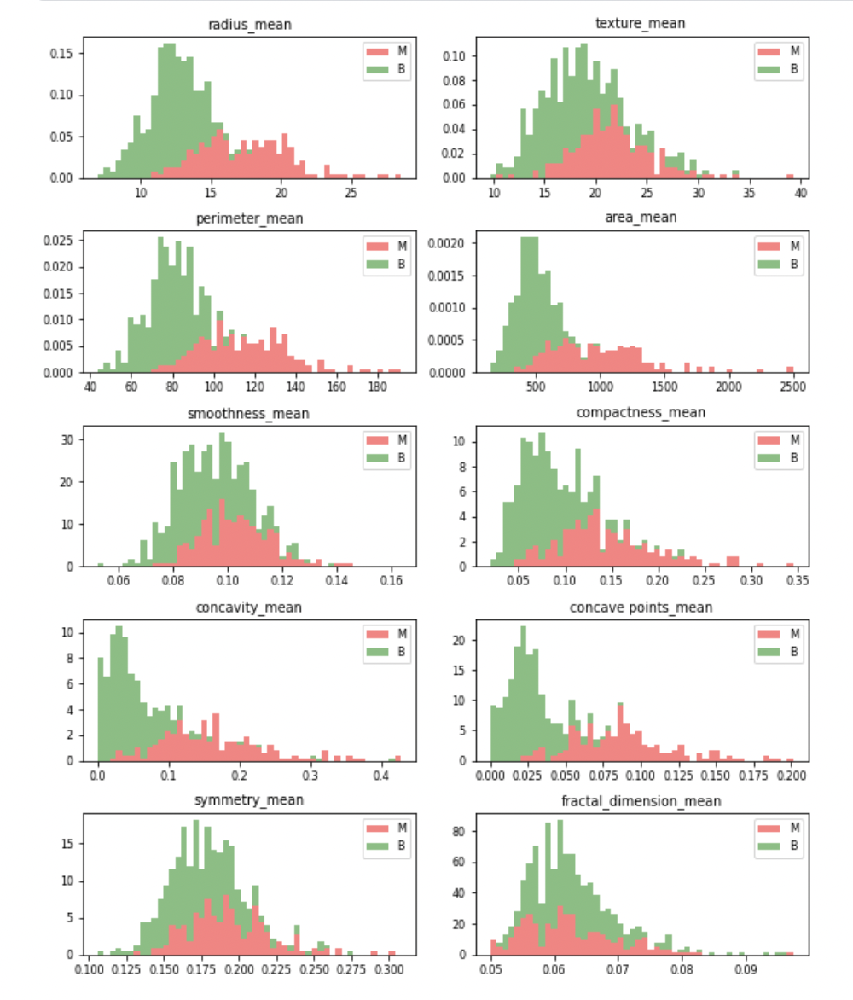

# Breast Cancer Prediction 
Breast Cancer Prediction using the Wisconsin breast cancer diagnostic data set for predictive analysis¶. In this project, four models are evaluated based on their prediction accuracy.


* Logistic regression
* Decision Tree
* Random Forest
* Artificial Neural Network (ANN)

## Prerequisites

`pip install -r requirements.txt`

## Dataset
Wisconsin breast cancer diagnostic data set used here can be found [here](https://www.kaggle.com/uciml/breast-cancer-wisconsin-data).

Attribute Information:

1. ID number
2. Diagnosis (M = malignant, B = benign) 
3. \- 32. Ten real-valued features are computed for each cell nucleus:

```
a) radius (mean of distances from center to points on the perimeter)
b) texture (standard deviation of gray-scale values)
c) perimeter
d) area
e) smoothness (local variation in radius lengths)
f) compactness (perimeter^2 / area - 1.0)
g) concavity (severity of concave portions of the contour)
h) concave points (number of concave portions of the contour)
i) symmetry
j) fractal dimension ("coastline approximation" - 1)
```
The mean, standard error and "worst" or largest (mean of the three largest values) of these features were computed for each image, resulting in 30 features. For instance, field 3 is Mean Radius, field 13 is Radius SE, field 23 is Worst Radius.


### Observations



1. Mean values of cell radius, perimeter, area, compactness, concavity and concave points can be used in classification of the cancer. Larger values of these parameters tends to show a correlation with malignant tumors. 
2. Mean values of texture, smoothness, symmetry or fractual dimension don't show a particular preference of one diagnosis over the other. In any of the histograms there are no noticeable large outliers that require further cleanup.


## Methodology

Four models mentioned above have been trained. Model performance after feature selection is also evaluated for exploration. 

### Training Test Split
Training and test split with a ratio of 80:20 is carried out. 

### ANN
Optimal hyperparameters are selected after some experimentation. Final ANN architecture has one input layer with all ten features, one hidden layer of size five, and an output node. First two layers use Rectified Linear Units (ReLU) ctivation function whereas output layer uses the sigmoid activation function that will squeeze all the values between 0 and 1 into the form of a sigmoid curve.One output unit is used since for each record values in X, a probability will be predicted. If it is high ( >0.9) than the tumor is definitely malignant. If it is less ( <0.2) then it is definitely benign.


5-fold cross-validation is used to prevent overfitting during training with early stopping with patience epoch count of 20 and maximum epoch count of 200. Thus, if the validation score (prediction accuracy of the model on validation set) has not improved in the las 20 epochs, the training in that fold has been stopped. 

### Holdout Test
Final model performance is assessed through test data set prediction accuracy for all models.

## Results

The best model to be used for diagnosing breast cancer as found in this analysis is the ANN based on holdout test results. Using all features for training yields better results than as with feature selection.

The prediction accuracy for the test data set using the:

1. logistic regression model is 90.35%.
2. random forest model is 92.98%.
3. decision tree model is 92.98%.
4. ANN is 93.86%.
